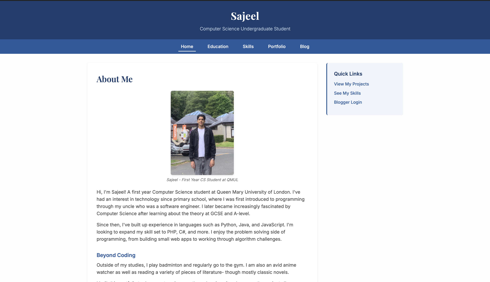
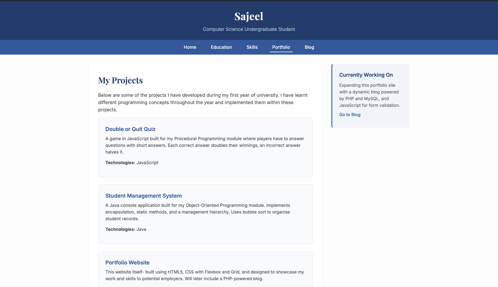
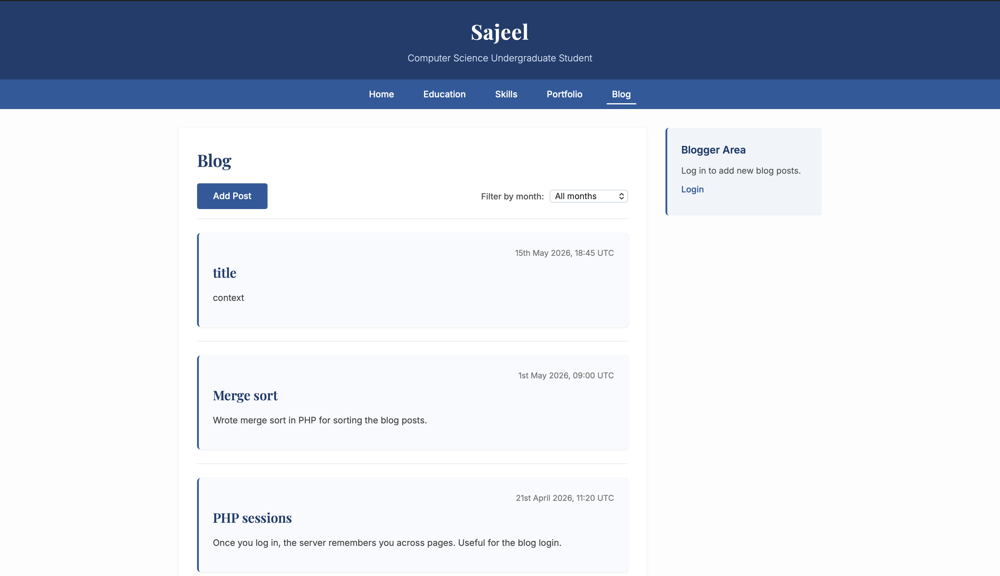
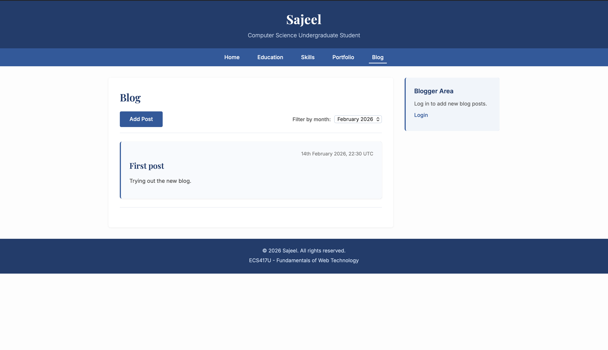
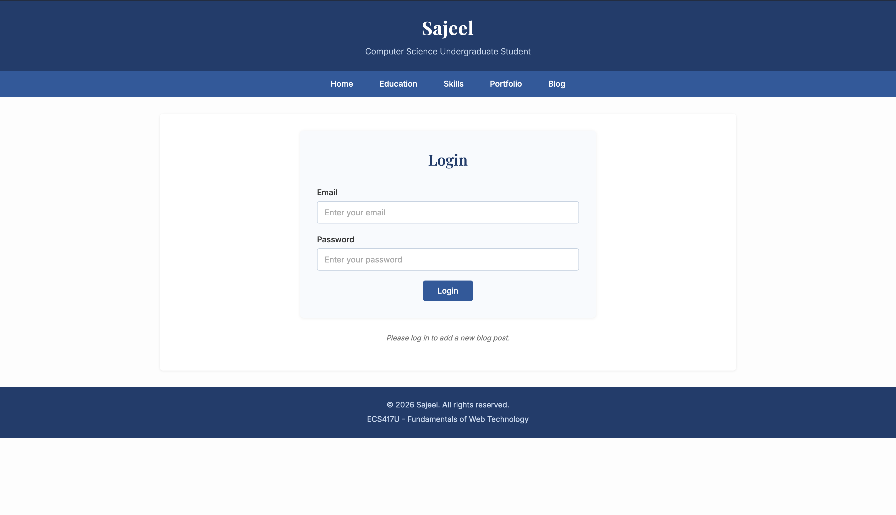

# Portfolio & Blog Platform

A full-stack web application built for ECS417U (Fundamentals of Web Technology) at Queen Mary University of London.

- **User authentication** — login, session management, and logout with PDO prepared statements for SQL injection protection
- **Portfolio entries** — add and view portfolio items through authenticated forms
- **Blog platform** — create, view, filter, and sort blog posts
- **Dynamic content** — JavaScript-based filtering and PHP-driven sorting for blog entries
- **Form validation** — both client-side (JavaScript) and server-side (PHP)
- **Responsive design** — CSS Grid and Flexbox layouts across a multi-page interface
- **Semantic HTML5** — accessible markup throughout (header, nav, main, article, section, aside, footer)

## Technologies

- **Backend:** PHP 7+ with PDO for database access
- **Database:** MySQL with a structured relational schema
- **Frontend:** HTML5, CSS3 (Grid, Flexbox), JavaScript
- **Typography:** Google Fonts (Inter, Playfair Display)
- **Security:** PDO prepared statements, server-side input validation

## Project Structure

```
personal-portfolio/
├── js/
│   ├── blogFilter.js       # Client-side blog filtering
│   └── validation.js       # Form validation
├── images/                 # Site imagery
├── db.php                  # PDO database connection
├── database_setup.sql      # MySQL schema definition
├── index.php               # Homepage
├── education.php           # Education page
├── skills.php              # Skills page
├── portfolio.php           # Portfolio listing
├── login.php               # Login form
├── loginProcess.php        # Login authentication handler
├── logout.php              # Session termination
├── addEntry.php            # Portfolio entry creation
├── addPost.php             # Blog post creation
├── viewBlog.php            # Blog listing and viewing
├── preview.php             # Content preview
├── sort.php                # Server-side sorting
├── styles.css              # Main stylesheet
└── reset.css               # CSS reset for consistent styling
```

## Running Locally

Requirements: PHP 7+, MySQL, a local server (XAMPP, MAMP, or similar).

1. Clone the repository:
```
   git clone https://github.com/itsajeel/personal-portfolio.git
   cd personal-portfolio
```

2. Import the database schema:
   - Open your MySQL client (phpMyAdmin, MySQL Workbench, or command line)
   - Create a database named `portfolio`
   - Import `database_setup.sql` to set up the tables

3. Configure the database connection in `db.php` if your MySQL setup differs from the XAMPP/MAMP defaults (default: `localhost`, user `root`, empty password).

4. Serve the project directory with your local PHP server (e.g., start Apache/MySQL via XAMPP).

5. Open `http://localhost/personal-portfolio/index.php` in your browser.

## Screenshots

### Homepage


### Portfolio Page


### Blog


### Blog with Filter Applied


### Login


## Coursework Context

This project was Phase 2 of the ECS417U coursework, building on Phase 1's static HTML/CSS portfolio. Phase 2 added:

- A PHP backend for dynamic page generation
- MySQL database integration for persistent data storage
- User authentication and session management
- Dynamic content features (filtering, sorting, CRUD operations)

## Author

Sajeel Khan — Computer Science Undergraduate, Queen Mary University of London
GitHub: [github.com/itsajeel](https://github.com/itsajeel)
